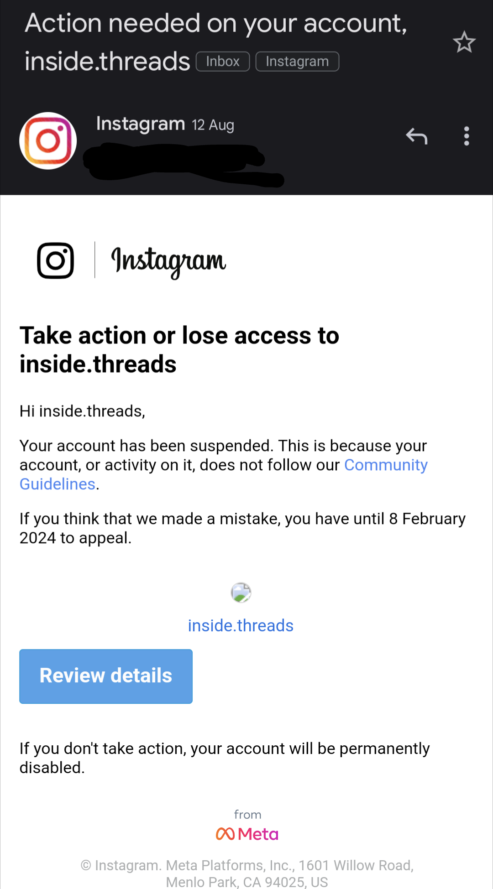
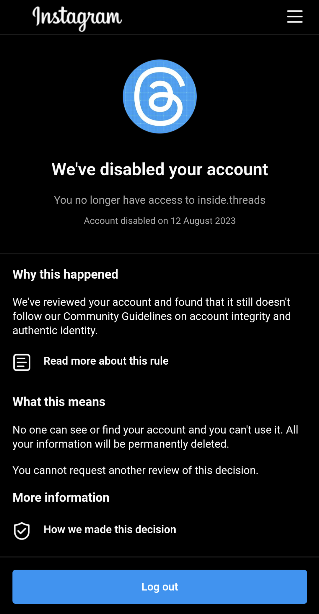

This post was originally intended to be a positive, optimistic take on Meta's social media platform Threads. I joined on day dot, number 45,375 of more than 100,000,000, keen to feel the energy I felt on Twitter before you-know-what.

I've been using Mastodon regularly since November (shout out Jerry @ Infosec!) and I do enjoy it there, but I see it primarily as a platform to connect with my industry colleagues on a channel less formal than LinkedIn. The majority of my friends and personalities I want to follow with just aren't interested in joining Mastodon. That's why I was optimistic about Threads - a fresh approach to text-based networking with a social graph to boot.

My excitement for Threads led me to try and make content for it. I've previously made content for fun, namely travel TikToks, and wanted to get in early. Inspired by Jane Manchun Wong (who funnily enough now works on the Threads team), and people's loud desires for features like a simple chronological feed, I created "inside.threads".

I develop mobile apps (in React Native) for a living but have never decompiled an app before this project. I spent hours learning and planning how to use apktool, how to read the output of apkdiff, and understanding the general layout of Meta's app architecture. I ended up developing a process that took about 20 minutes per beta release:

- Grabbing the release from my device or ApkMirror
- Unzip the APK and upload the contents to a GitHub repo
- Run APKTool on the APK and upload some of the decompiled parts of interest to a different GitHub repo
- Use GitHub to compare the app to the previous version
- Upload code, text and image differences to Google Drive to share on Threads (as it still doesn't have a webapp)

I processed over a dozen releases like this and was one of the first accounts to discover the chronological following feed. All was well for the first month, gaining nearly 100 followers including a dozen Meta employees, many of whom engaged with the content. That was until I received an email on the 12th of August.

I've never thought about the community guidelines when creating and putting time into this account. While the email doesn't state what guideline I failed to follow, it seems that my use of the Threads logo in the profile picture suddenly wasn't okay. I had a disclaimer in the bio that the account wasn't affiliated with Meta but that's beside the point. Whatever the reason was, I wasn't given the option to change any info / profile picture etc, I was just presented with an "appeal" button. Naturally for Meta, I practically instantly got a "final rejection" meaning the account is now permanently banned.

Perhaps what I learned from this situation is something you already know. Don't think companies care about you. I am usually as cynical about enterprises like Meta, and was never interested in working there from the numerous scandals. But I felt like this was different because I had a reason to be passionate about Threads. But this is just the cold-hearted nature of a platform run by algorithms.

Just as well Threads turned out to be a nothingburger anyway. ∎
