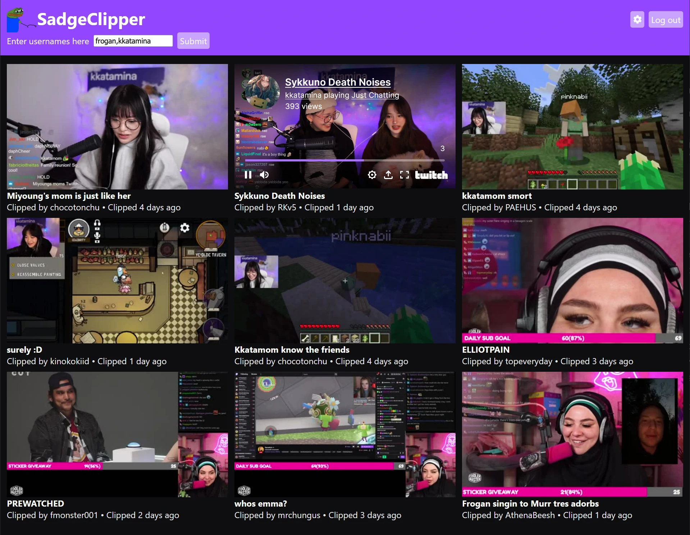

**The brief:** A key feature of the streaming platform Twitch is "clips". Clips are short, shareable highlights/snippets of streams that anyone watching can create. Streamers often share their clips on social media for promotion, and some streamers even hire editors to curate and edit clips for longer highlight reels, to upload to YouTube, TikTok, and similar platforms. A number of editors create highlight reels independently of any single streamer, too.

A common complaint these editors held at the time was that Twitch's interface for clips was clunky and inefficient, especially for editors creating content from multiple streamers. From talking to a number of editors, I determined that a good interface for searching for clips would allow for easy previewing of clips, allow for easy searching and filtering, and allow for searching multiple streamers at once.

**The result:** With a lightweight (~140 KB), simple JavaScript web-app, I created a simple interface based on the Twitch API. I designed the interface to be intuitive to use, mobile-friendly and easily configurable. A settings menu allows the user to change the page size, toggle the preview clip functionality, and how many days to search for clips.

I developed the interface with constant feedback from editors, some of whom ended up using the webapp as their direct source of clips thanks to how useful they found the interface.

To get clips, the app makes heavy use of the [Twitch Helix API](https://dev.twitch.tv/docs/api/). I implemented a lightweight oAuth authentication handler to enable the use of the API.

The app uses [Cash](https://github.com/fabiospampinato/cash), a modern jQuery-like wrapper which was quicker to ship with than vanilla JavaScript. It also uses [dayjs](https://day.js.org/) and [timeago.js](https://github.com/hustcc/timeago.js) for date manipulation and [localForage](https://localforage.github.io/localForage/) as a wrapper for local storage, for storing user preferences. Finally, [micromodal](https://micromodal.vercel.app/) abstracts away the preferences pop-up.
